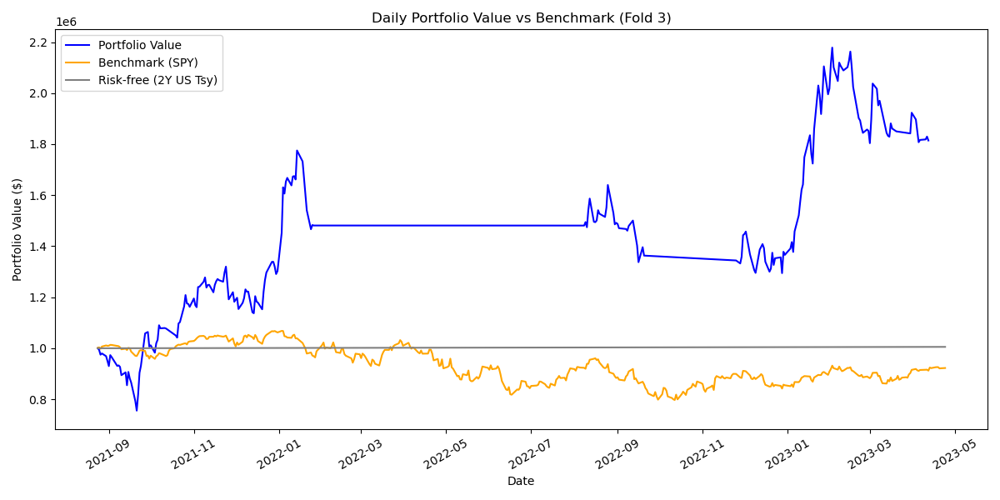
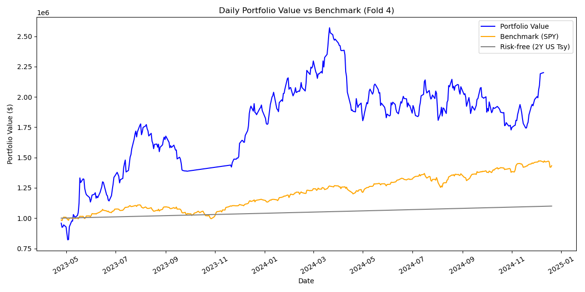

\begin{center}
    {\LARGE \textbf{Trading Large-Cap US Equities Using LSTM Models}} \\
    \vspace{0.5cm}
    By: Royce LIM
\end{center}

------------------------------------------------------------------------

\newpage

# 1. Introduction

The use of deep learning in financial markets today is ubiquitous, as traders hope to harness its superior pattern recognition abilities to gain an edge over the market. Given that asset prices often exhibit temporal dependencies, Recurrent Neural Networks (RNN) have emerged as many traders' model of choice, as their in-built feedback loops enable it to effectively learn from sequential time series.

In this study, I chose to use *Long Short-Term Memory (LSTM)* networks — a class of RNNs that relies on both long-term and short-term states to generate outputs — to model share price movements of S&P 500 companies. Specifically, I sought to predict whether each stock's price would rise by at least 2% over a 5-day period. Thereafter, I designed and backtested a simple leveraged trading strategy based on my model's forecasts.

In this document, I offer an overview of my methodology and analyse the results of my model.

\newpage

# 2. Methodology

This study took the stock price of 50 S&P 500 companies from 1 Jan 2013 to 20 Dec 2024 selected from 5 sectors. The data was split into 5 Train-Test folds. For each fold, LSTM models were trained on all preceding price, momentum, earnings, and macroeconomic data grouped by GICS sector. These models adopted a binary classification approach, returning '1' when a stock's 5-day return is expected to exceed 2% and '0' otherwise. Thereafter, the performance of each model was assessed against 20-month validation periods.

To examine the practical viability of this approach, models from each sector were aggregated to generate daily 'buy' orders across all 50 stocks and backtested on virtual portfolios over each validation period. To ensure this simulation was as realistic as possible, elements such as commissions were included. Furthermore, to capture greater alpha while managing downside potential, strategies such as leverage and stop-losses were implemented as well. Portfolio performance was then evaluated against benchmark and risk-free returns using several financial metrics.

Given the complexity of this approach, this process was broken down into 3 phases: Data Processing, Model Training and Strategy Backtesting. Each phase was further split into multiple scripts by sector or fold to enable parallel processing via the main script (`__main__.py`) before being passed into a fourth Final Sumamry phase to generate fold- and sector-wide statistics.

## 2.1 Data Processing

### 2.1.1 Price Data

For this study, the top 5 GICS sectors in terms of volatility were chosen on the basis that they had the greatest alpha to exploit. For each sector, the top 10 stocks in terms of market capitalization with data available from 1 Jan 2013 were chosen. The final selection of sectors and tickers are as shown:

```python
lib_tickers = {
    'COMMUNICATION_SERVICES':
        ['CMCSA', 'DIS', 'EA', 'GOOGL', 'LYV', 'META', 'NFLX', 'PARA', 'T', 'VZ'],
    'CONSUMER_DISCRETIONARY':
        ['AMZN', 'BKNG', 'CMG', 'GM', 'HD', 'LULU', 'NKE', 'SBUX', 'TSLA', 'ULTA'],
    'ENERGY':
        ['CVX', 'COP', 'EOG', 'HAL', 'KMI', 'MPC', 'OKE', 'PSX', 'WMB', 'XOM'],
    'FINANCIALS':
        ['BAC', 'BLK', 'BX', 'CBOE', 'COF', 'GS', 'JPM', 'MA', 'MSCI', 'PRU'],
    'INFORMATION_TECHNOLOGY':
        ['AAPL', 'AMD', 'CRM', 'FTNT', 'IBM', 'MSFT', 'NVDA', 'ORCL', 'PANW', 'SNPS']
    }
```

Daily price data was downloaded from [Stooq](https://www.stooq.com) in OHLCV format and converted into Pandas dataframes with DateTime indices. Dates incorporated as features using Sine-Cosine transformation by quarter, and both daily and 5-day returns were calculated. The average standard deviation of daily returns over the next 5 days was estimated using a GARCH(1,1) model.

```python
def add_quarter_sin_cos(df):
    """Adds sine and cosine encoding for quarters to a DataFrame with a DatetimeIndex."""
    new_df = df.copy()
    quarters = new_df.index.quarter
    T = 4
    new_df['Quarter_Sin'] = np.sin(2 * np.pi * (quarters - 1) / T)
    new_df['Quarter_Cos'] = np.cos(2 * np.pi * (quarters - 1) / T)
    return new_df

# ...

def predGARCH(series, cut, horizon):
    """Calculate GARCH of Pct_Price"""
    res = pd.Series(index = series.index, dtype = float)
    
    for i in range(len(series) - cut):
        print(i)
        ind = cut + i
        train_set = series[max(0, ind - cut):ind]
        fit_GARCH = arch_model(train_set , p = 1, q = 1, dist = 'normal').fit()
        forecast_GARCH = fit_GARCH.forecast(horizon = horizon)
        res.iloc[ind] = float(np.sqrt(np.mean(forecast_GARCH.variance.values)))

    return res
    
# ...

  data_process = add_quarter_sin_cos(data_raw)
  data_process['Pct_Price'] = data_process['Close'].pct_change().mul(100).fillna(0)
  data_process['Pct_PriceN'] = data_process['Close'].pct_change(forecast_period).mul(100).fillna(0)
  data_process['GARCH_Sig'] = predGARCH(data_process.Pct_Price, 500, forecast_period)
```

### 2.1.2 Momentum Indicators

Using the `data_process` dataframe, the 5-day and 20-day Exponential Moving Averages (EMA) and Double EMAs (DEMA) were calculated. Additionally, the Moving Average Convergence/Divergence histogram (MACD), Relative Strength Index (RSI), Positive Directional Index (+DI) and Negative Directional Index (-DI) were also determined. Among the multitude of momentum indicators available, these were chosen based on their popularity among swing traders and horizons were adjusted to suit the 5-day horizon of the model.

```python
def EMA(series, n):
    """Calculate Exponential Moving Average (EMA)."""
    return series.ewm(span=n, adjust=False).mean()

def DEMA(series, n):
    """Calculate Double Exponential Moving Average (DEMA)."""
    ema = EMA(series, n)
    dema = (2 * ema) - EMA(ema, n)
    return dema

def MACD_HIST(series, fast=12, slow=26, signal=9):
    """Calculate Moving Average Convergence Divergence (MACD)."""
    macd_line = EMA(series, fast) - EMA(series, slow)
    signal_line = EMA(macd_line, signal)
    macd_histogram = macd_line - signal_line
    return macd_histogram

def RSI(series, n):
    """Calculate Relative Strength Index (RSI)."""
    delta = series.diff()
    gain = delta.where(delta > 0, 0)
    loss = -delta.where(delta < 0, 0)

    avg_gain = gain.rolling(window=n, min_periods=n).mean()
    avg_loss = loss.rolling(window=n, min_periods=n).mean()

    rs = avg_gain / avg_loss
    rsi = 100 - (100 / (1 + rs))
    return rsi

def PLUS_DI(df, n):
    """Calculate Plus Directional Indicator (+DI)."""
    high_diff = df['High'].diff()
    low_diff = df['Low'].diff()

    plus_dm = high_diff.where((high_diff > low_diff) & (high_diff > 0), 0)
    tr = True_Range(df)
    plus_di = 100 * EMA(plus_dm, n) / EMA(tr, n)
    return plus_di

def MINUS_DI(df, n):
    """Calculate Minus Directional Indicator (-DI)."""
    high_diff = df['High'].diff()
    low_diff = df['Low'].diff()

    minus_dm = low_diff.where((low_diff > high_diff) & (low_diff > 0), 0)
    tr = True_Range(df)
    minus_di = 100 * EMA(minus_dm, n) / EMA(tr, n)
    return minus_di

def True_Range(df):
    """Calculate True Range (TR) for +DI and -DI."""
    high_low = df['High'] - df['Low']
    high_close = abs(df['High'] - df['Close'].shift())
    low_close = abs(df['Low'] - df['Close'].shift())

    tr = pd.concat([high_low, high_close, low_close], axis=1).max(axis=1)
    return tr
    
# ...

  data_process['EMA_SHORT'] = EMA(data_process['Close'], forecast_period).fillna(0)
  data_process['EMA_LONG'] = EMA(data_process['Close'], forecast_long).fillna(0)
  data_process['DEMA_SHORT'] = DEMA(data_process['Close'], forecast_period).fillna(0)
  data_process['DEMA_LONG'] = DEMA(data_process['Close'], forecast_long).fillna(0)
  data_process['MACD_HIST'] = MACD_HIST(data_process['Close']).fillna(0)
  data_process['RSI'] = RSI(data_process['Close'], forecast_long).fillna(0)
  data_process['PLUS_DI'] = PLUS_DI(data_process, forecast_long).fillna(0)
  data_process['MINUS_DI'] = MINUS_DI(data_process, forecast_long).fillna(0)
```

### 2.1.3 Earnings Data

Earnings data was acquired from [AlphaVantage](https://www.alphavantage.co). The EPS and % Surprise were extracted while Quarterly and Yearly % change in EPS were calculated. This data was then reindexed to align with `data_process`.

```python
  earnings_raw = pd.DataFrame(earnings_raw_json[ticker]['quarterlyEarnings'])
  earnings_raw.index = pd.to_datetime(earnings_raw.reportedDate)
  earnings_raw.index.name = None
  earnings_raw = earnings_raw.drop(
      ['fiscalDateEnding', 'reportedDate', 'reportTime', 'estimatedEPS', 'surprise'],
      axis = 1
      )
  earnings_raw = earnings_raw.rename(
      {'reportedEPS': 'EPS', 'surprisePercentage': 'Pct_Surprise'},
      axis = 1
      )
  earnings_raw = earnings_raw.sort_index()
  earnings_raw = earnings_raw.replace('None', 0).astype(float)
  earnings_raw['Pct_EPS'] = earnings_raw['EPS'].pct_change().mul(100)
  earnings_raw['Pct_EPS_YTY'] = earnings_raw['EPS'].pct_change(4).mul(100)
  earnings_raw = earnings_raw.reindex(backtest_daterange, method = 'ffill', fill_value = 0)
```

### 2.1.4 Macroeconomic Data

Macroeconomic data was acquired from [FRED](https://fred.stlouisfed.org/). In this study, I took Annual % Change in GDP, Inflation Rate, Fed Funds Effective Rate and the 2-Year-10-Year U.S. Treasury Bond Yield Spread. This data was then reindexed to align with `data_process`.

```python
  macro_raw = pd.DataFrame(
      columns = ['PCT_REALGDP', 'INFLATION', 'FFR', 'T10Y2Y'],
      index = backtest_daterange
      )
  
  for header in macro_raw.columns:
      inPut = wd + f'/RAW_DATA/MACRO/{header}_20132024_RAW.csv'
      macro_raw_series = pd.read_csv(inPut,
                             parse_dates = ['observation_date'],
                             index_col = 'observation_date')
      macro_raw[header] =  macro_raw_series
      macro_raw[header] = macro_raw[header].ffill().fillna(0)
```

### 2.1.5 Summary

All of the above dataframes were then joined into one dataframe and labelled `0` or `1` depending on whether the next 5-day return would exceed 2%. This data was then exported using Pandas' \`pd.to_csv()' for use in the next phase.

```python
def categorizeReturn(x, ret):
    """One-hot encode buy signals"""
    if x >= ret: return(1)
    else: return(0)
    
# ...

  data_process = data_process.map(lambda x: 0 if abs(x) < 1e-6 else x)
  data_process = pd.concat([data_process, earnings_raw, macro_raw], axis = 1)
  data_process['Label'] = [categorizeReturn(x, min_return) for x in data_process['Pct_PriceN'].shift(-1)]
  data_process = data_process.dropna()
  
  outPut = wd + f'/PROCESSED_DATA/RNN_MARK6_DATA_{sector}_{ticker}.csv'
  data_process.to_csv(outPut, index = True, index_label = 'Date')
```

In summary, the model has 21 features, as shown:

```python
data_process.columns = ['Open', 'High', 'Low', 'Close', 'Volume', 'Quarter_Sin', 'Quarter_Cos', 'Pct_Price',
       'Pct_PriceN', 'GARCH_Sig', 'EMA_SHORT', 'EMA_LONG', 'DEMA_SHORT',
       'DEMA_LONG', 'MACD_HIST', 'RSI', 'PLUS_DI', 'MINUS_DI', 'EPS',
       'Pct_Surprise', 'Pct_EPS', 'Pct_EPS_YTY', 'PCT_REALGDP', 'INFLATION',
       'FFR', 'T10Y2Y', 'Label']
```

## 2.2 Model Training

### 2.2.1 Data Preparation

For each ticker in each sector, the corresponding CSV file from **Section 2.1** was loaded with OHLCV columns dropped. Then, all inputs were standardized to ensure that all variables are on a similar scale, preventing features with larger magnitudes from dominating the model’s learning process. Additionally, scaling accelerates model convergence during training by improving numerical stability. Each feature was scaled using either Min-Max scaling or Normal Distribution scaling, depending on its likelihood of following a normal distribution — the latter generally applied to percentage-change features.

```python
data_transformers = [
    ('standard', StandardScaler(), ['Pct_Price', 'Pct_PriceN', 'Pct_Surprise', 'Pct_EPS', 'Pct_EPS_YTY', 'PCT_REALGDP', 'INFLATION', 'T10Y2Y']),
    ('minmax', MinMaxScaler(), ['GARCH_Sig', 'EMA_SHORT', 'EMA_LONG', 'DEMA_SHORT', 'DEMA_LONG', 'MACD_HIST', 'RSI', 'PLUS_DI', 'MINUS_DI', 'EPS', 'FFR'])
    ]
column_transformer = ColumnTransformer(data_transformers, remainder='passthrough')

# ...

  column_transformer.fit(data_process)
  data_scaled = column_transformer.transform(data_process)
```

Using `TimeSeriesSplit` from `sklearn.model_selection`, 5 pairs of Train-Test fold indices were created and the data was filtered into its corresponding fold. The 'Test' indices represented approximately 20-month test periods while the 'Train' indices represented all data prior to said period. This enabled robust model validation and backtesting as model performance was observed over 5 different investment periods with unique market dynamics.

```python

n_folds = 5

# ...

split_object = TimeSeriesSplit(n_splits = n_folds)

# ...

  train_ind, valid_ind = [(t, v) for t, v in split_object.split(data_process)][fold]
  data_train_dict[ticker] = data_scaled[train_ind]
  data_valid_dict[ticker] = data_scaled[valid_ind]
```

Lastly, a custom `Dataset` class from `torch.utils.data` was created to reshape the data dictionaries for loading into the LSTM model. Specifically, sequences of shape `(lookback, input_size)` were created by the `StockDataset` object to match successive labels and loaded into a `DataLoader` object where `shuffle = False` to maintain the temporal integrity of our data. With a forecast horizon of 5 days, `lookback = 10` was determined to be a suitable observation window that provided sufficient historical context for the model to capture relevant patterns.

```python
input_size = 21

# ...

lookback = 10
batch_size = 16

# ...

class StockDataset(Dataset):
    def __init__(self, data_dict, feature_cols, label_col, lookback):
        """
        data_dict: dict of {ticker: DataFrame}, each DataFrame has features and Label.
        feature_cols: list of feature column indices
        label_col: index of the label column
        lookback: number of past steps to form a sequence
        """
        self.X = []
        self.y = []
        # Convert each stock's DataFrame (already transformed to np.array) into sequences
        for ticker, mat in data_dict.items():
            labels = mat[:, label_col]
            features = mat[:, feature_cols]
            
            # Create sequences of length `lookback`
            for i in range(len(mat) - lookback):
                seq_x = features[i:i+lookback,:]
                seq_y = labels[i+lookback]  # Forecast horizon = 1 already aligned
                self.X.append(seq_x)
                self.y.append(seq_y)
        
        self.X = np.array(self.X, dtype=np.float32)
        self.y = np.array(self.y, dtype=np.int64)
        
    def __len__(self):
        return len(self.X)

    def __getitem__(self, idx):
        return torch.tensor(self.X[idx], dtype=torch.float32), torch.tensor(self.y[idx], dtype=torch.long)
        
#...

    train_dataset = StockDataset(data_train_dict, feature_cols = list(range(input_size)), label_col = input_size, lookback = lookback)
    valid_dataset = StockDataset(data_valid_dict, feature_cols = list(range(input_size)), label_col = input_size, lookback = lookback)
    
    train_loader = DataLoader(train_dataset, batch_size = batch_size, shuffle = False)
    valid_loader = DataLoader(valid_dataset, batch_size = batch_size, shuffle = False)
```

### 2.2.2 Model Architecture

The fundamental architecture of our model was built into custom `Module` object using PyTorch's `torch.nn`. Here is a breakdown of its key components:

**LSTM Layer (`self.lstm`)**

The LSTM layer which captured sequential dependencies in the input data and formed the bedrock of our entire model.

*Key Arguments*:

-   `input_size`: Number of input features per time step.\
-   `hidden_size`: Number of hidden units in each LSTM layer.\
-   `num_layers`: Number of stacked LSTM layers.\
-   `dropout`: Dropout rate applied between LSTM layers to prevent overfitting.\
-   `batch_first=True`: Ensures input/output tensors have shape `(batch, lookback, input_size)`.

**Fully Connected Layer (`self.fc`)**

This was the fully connected layer maps the hidden state at the last time step to the output size. It produces the final prediction by applying a linear transformation.

**Feature Weights (`self.feature_weights`)**

Learnable weights initialized as a tensor of ones with size `input_size`. These allowed the model to learn the relative importance of each feature by dynamically adjusting their contribution during training.

**Alpha (`self.logit_alpha`)**

To allow our model to accord exponentially greater importance to recent information, a learnable parameter in logit space was introduced. This paramater controls exponential decay weighting for past time steps. After applying a sigmoid transformation, `alpha` is used to compute time-based weights:

$$ \text{W}_t = e^{-\alpha \cdot (\text{lookback} - 1 - t)} $$

**Forward Method (`def forward(self, x)`)**

Defined the operations during a forward pass:

1.  Multiplies each feature by its corresponding learnable weight (`self.feature_weights`).

2.  Applies exponential decay weighting using `alpha`.

3.  Passes the weighted input through the LSTM layer.

4.  Extracts the hidden state at the last time step and passes it through the fully connected layer to produce the final output.

**Dropout (`dropout`)**

Dropout was applied between LSTM layers to reduce overfitting by randomly zeroing out neurons during training.

```python
class LSTMModel(nn.Module):
    def __init__(self, input_size, hidden_size, output_size, num_layers, dropout, lookback):
        super(LSTMModel, self).__init__()
        self.lookback = lookback
        self.feature_weights = nn.Parameter(torch.ones(input_size))
        self.logit_alpha = nn.Parameter(torch.tensor(0.0))  # Learnable alpha in logit space
        self.lstm = nn.LSTM(input_size, hidden_size, num_layers=num_layers, batch_first=True, dropout=dropout)
        self.fc = nn.Linear(hidden_size, output_size)
        
        # Precompute time indices to avoid recomputing each forward
        self.register_buffer('time_indices', torch.arange(self.lookback, dtype=torch.float32))

    def forward(self, x):
        # x: (batch, lookback, input_size)
        
        # Apply feature weights
        x = x * self.feature_weights
        
        # Apply exponential decay weighting using alpha
        alpha = torch.sigmoid(self.logit_alpha)
        time_weights = torch.exp(-alpha * (self.lookback - 1 - self.time_indices))
        # shape of time_weights: (lookback,)
        # Expand to (batch, lookback, 1) for broadcast
        time_weights = time_weights.unsqueeze(0).unsqueeze(-1)
        x = x * time_weights
        
        out, _ = self.lstm(x)  # (batch, lookback, hidden_size)
        out = self.fc(out[:, -1, :])  # last time step
        return out
```

Additionally, a `TemperatureScaler` object was also created to optimize the scaling factor (i.e. Temperature) of the model's confidence in its predictions using the following formula:

$$\hat{z} = \frac{z}{T}$$

By adjusting the temperature, the model's confidence was calibrated to ensure that the predicted probabilities were neither too overconfident nor underconfident.

```python
class TemperatureScaler(nn.Module):
    def __init__(self, model):
        super(TemperatureScaler, self).__init__()
        self.model = model
        # Initialize temperature as a learnable parameter
        self.temperature = nn.Parameter(torch.ones(1) * 1.0)
    
    def forward(self, logits):
        # Apply temperature scaling to logits
        # logits: (batch_size, output_size)
        # return scaled logits
        return logits / self.temperature

    def set_temperature(self, train_loader, device='cpu'):
        """
        Tune the temperature using the validation set to minimize NLL.
        """
        # Move to the desired device
        self.to(device)
        self.model.to(device)
        self.model.eval()
        
        # Collect all logits and labels from the validation set
        logits_list = []
        labels_list = []
        with torch.no_grad():
            for inputs, labels in train_loader:
                inputs = inputs.to(device)
                labels = labels.to(device)
                # Forward pass through the base model to get logits
                outputs = self.model(inputs)
                logits_list.append(outputs)
                labels_list.append(labels)

        logits = torch.cat(logits_list)
        labels = torch.cat(labels_list)
        
        # Optimize temperature to minimize NLL
        nll_criterion = nn.CrossEntropyLoss()
        optimizer = optim.LBFGS([self.temperature], lr=0.01, max_iter=50)

        def eval():
            optimizer.zero_grad()
            loss = nll_criterion(self.forward(logits), labels)
            loss.backward()
            return loss

        # Run L-BFGS to find optimal temperature
        optimizer.step(eval)

        print(f"Optimised Temperature: {self.temperature.item()}")
        return self, self.temperature.item()
```

### 2.2.3 Training & Validation Loops

The LSTM model was initialized with the parameters shown below. It was optimised by minimizing Cross Entropy Loss using Adaptive Moment Estimation and evaluated based on its Accuracy, Precision, Recall and F1 Score.

```python
input_size = 21
num_classes = 2
device = torch.device("cuda" if torch.cuda.is_available() else "cpu")
task = 'multiclass'

#Training Settings
lookback = 10
batch_size = 16
num_epochs = 30
learning_rate = 1e-4
hidden_size = 64
num_layers = 2
dropout = 0.4

#...

    #Model Initialisation
    model = LSTMModel(input_size, hidden_size, num_classes, num_layers, dropout, lookback).to(device)
    
    criterion = nn.CrossEntropyLoss(weight = torch.FloatTensor(class_weights).to(device))
    optimizer = optim.Adam(model.parameters(), lr = learning_rate)
    
    #Metrics
    accuracy_metric = Accuracy(task = task, num_classes = num_classes).to(device)
    precision_metric = Precision(task = task, num_classes = num_classes, average='macro').to(device)
    recall_metric = Recall(task = task, num_classes = num_classes, average='macro').to(device)
    f1_metric = F1Score(task = task, num_classes = num_classes, average='macro').to(device)
```

The training loop was iterated over `num_epochs = 30`, which was when training accuracy tended to plateau. A standard training loop was adopted with L1 Regularization to prevent overfitting and allow the model to self-select relevant features from the broad array of features fed into it.

```python
        for features, labels in train_loader:
            features, labels = features.to(device), labels.to(device)
            optimizer.zero_grad()
            
            outputs = model(features)
            loss = criterion(outputs, labels)
            
            #L1 Regularization
            l1_penalty = sum(torch.sum(torch.abs(param)) for param in model.parameters())
            loss += l1_lambda * l1_penalty
    
            loss.backward()
            optimizer.step()
            
            running_loss += loss.item() * features.size(0)
            running_acc += accuracy_metric(outputs, labels) * features.size(0)
    
        epoch_train_loss = running_loss / len(train_dataset)
        epoch_train_acc = running_acc / len(train_dataset)
        train_losses.append(epoch_train_loss)
        train_accuracies.append(epoch_train_acc.item())
```

Thereafter, the trained model was evaluated against its corresponding test set using the aforementioned metrics based on both its overall and class-wise performance. These metrics were stored in a dictionary for further analysis later.

```python
        #Validation
        model.eval()
        running_loss_val = 0.0
        running_acc_val = 0.0
        all_outputs = []
        all_labels = []
    
        with torch.no_grad():
            for features, labels in valid_loader:
                features, labels = features.to(device), labels.to(device)
                outputs = model(features)
                loss_val = criterion(outputs, labels)
                
                running_loss_val += loss_val.item() * features.size(0)
                running_acc_val += accuracy_metric(outputs, labels) * features.size(0)
                all_outputs.append(outputs)
                all_labels.append(labels)
                
        epoch_val_loss = running_loss_val / len(valid_dataset)
        epoch_val_acc = running_acc_val / len(valid_dataset)
        valid_losses.append(epoch_val_loss)
        valid_accuracies.append(epoch_val_acc.item())
        
        all_outputs = torch.cat(all_outputs, dim = 0)
        all_labels = torch.cat(all_labels, dim = 0)
        
        precision_val = precision_metric(all_outputs, all_labels).item()
        recall_val = recall_metric(all_outputs, all_labels).item()
        f1_val = f1_metric(all_outputs, all_labels).item()
            
        diagnostics_dict = {
            'train_loss': float(epoch_train_loss),
            'train_acc': float(epoch_train_acc),
            'val_loss': float(epoch_val_loss),
            'val_acc': float(epoch_val_acc),
            'val_precision': float(precision_val),
            'val_recall': float(recall_val),
            'val_f1': float(f1_val)
            }
            
#...

        # Compute class-wise metrics
        class_acc = accuracy_per_class(all_outputs, all_labels).numpy()
        class_prec = precision_per_class(all_outputs, all_labels).numpy()
        
        # Array of Outputs and Labels
        pred_ind = torch.argmax(torch.softmax(all_outputs, dim = -1), dim = -1).numpy()
        actual_ind = all_labels.numpy()
        
        # Print class-wise accuracy, precision and occurrence
        for c in range(num_classes):
            pred_prop = np.mean(pred_ind == c)
            actual_prop = np.mean(actual_ind == c)
            diagnostics_dict[c] = {
                'class_acc': class_acc[c],
                'class_precision': class_prec[c],
                'predicted_pct': pred_prop,
                'actual_pct': actual_prop
                }
            output_text = output_text + (
                f"\nClass {c} Acc: {diagnostics_dict[c]['class_acc']:.4f} \n"
                + f"Class {c} Precision: {diagnostics_dict[c]['class_precision']:.4f} \n"
                + f"Class {c} Predicted %: {(diagnostics_dict[c]['predicted_pct'] * 100):.2f}% \n"
                + f"Class {c} Actual %: {(diagnostics_dict[c]['actual_pct'] * 100):.2f}% \n"
                )
        
        print(output_text)
```

After that, the `TemperatureScaler` object was wrapped around the model to find the optimal temperature.

```python
    temp_scaler = TemperatureScaler(model)
    _, temp_optim = temp_scaler.set_temperature(valid_loader, device=device)
```

Lastly, the loss and accuracy over epochs graphs were plotted and exported for further analysis, while the backtest indices, optimized model parameters, optimized temperature, the diagnostics dictionary and learned relative feature weights were all exported using PyTorch's `torch.save` for use in the subsequent phase.

```python
    #Plotting Loss and Accuracy Metrics
    fig = plt.figure(figsize=(10, 5))
    plt.subplot(1, 2, 1)
    plt.plot(train_losses, label='Train Loss')
    plt.plot(valid_losses, label='Valid Loss')
    plt.title('Loss over epochs')
    plt.legend()
    plt.grid(True)
    
    plt.subplot(1, 2, 2)
    plt.plot(train_accuracies, label='Train Acc')
    plt.plot(valid_accuracies, label='Valid Acc')
    plt.title('Accuracy over epochs')
    plt.legend()
    plt.grid(True)
    
    plt.tight_layout()
    
    outPut = wd + f'/RESULTS/FOLD{fold}/TRAIN_VALID_PLOT/TRAIN_VALID_PLOT_{sector}_{fold}.png'
    fig.savefig(outPut)

    #Saving and printing learned feature weights and alpha
    with torch.no_grad():
        learned_feature_weights = model.feature_weights.cpu().numpy()
        print("Learned Feature Weights:", learned_feature_weights)
        
        learned_relative_weights = torch.softmax(model.feature_weights, dim=0).cpu().numpy()
        learned_relative_weights = dict(zip(data_process.columns.values[:len(data_process.columns) - 1], learned_relative_weights))
        print("Relative Weights (softmax):", learned_relative_weights)
        
        learned_alpha = float(torch.sigmoid(model.logit_alpha).detach())
        print("Optimized alpha:", learned_alpha)
    
    #Save Results
    outPut = wd + f'/MODELS/FOLD{fold}/RNN_MARK6_MODEL_{sector}_{fold}.pth'
    torch.save({
        'backtest_ind': valid_ind,
        'model_state': model.state_dict(),
        'temp_optim': temp_optim,
        'diagnostics': diagnostics_dict,
        'relative_weights': learned_relative_weights
            },
        outPut
        )
```

## 2.3 Strategy Backtesting

### 2.3.1 Loading Data and Models

For each sector, price and feature data from **Section 2.1** as well as the various items from **Section 2.2** were loaded. Feature data was scaled and stored in a `StockDataset` object as above, while price data was restructured into a dictionary with date keys that nest OLC price dictionaries (i.e. Price Map).

```python
#Preparing Price Map for Backtest
data_backt_dict = {}

for date, df in data_backt_df.groupby(data_backt_df.index):
    data_backt_dict[date] = {}
    
    for ticker, nested_df in df.groupby('Ticker'):
        data_backt_dict[date][ticker] = {
            'open': float(nested_df.Open.values),
            'low': float(nested_df.Low.values),
            'close': float(nested_df.Close.values)
            }
```

### 2.3.2 Generating Order Sheet

After the model was initialized in evaluation mode, it was used to predict the labels for the test set. Each prediction and its corresponding Temperature-adjusted confidence was logged in a dataframe. After the dataframe was filtered for positive buy signals (i.e. `Label == 1`), it was sorted in ascending order of Date then descending order of Confidence.

```python
            #LSTM Predictions
            with torch.no_grad():
            for i, (features, _) in enumerate(data_scaled_loader):
                features = features.to(device)
                output = model(features)
                pred_position = float(torch.argmax(torch.softmax(output, dim = -1), dim = -1))
                pred_confidence = float(torch.softmax(output / temperature, dim = -1).max())
                order_df_temp.iloc[i] = [pred_position, pred_confidence]
        
        #Outputting final order
        order_df_temp = order_df_temp.loc[order_df_temp['Position'] == 1]
        order_df_temp['Ticker'] = ticker
        order_df_temp = order_df_temp.drop(['Position'], axis = 1)
        order_df_temp = order_df_temp[['Ticker', 'Confidence']]
        orders_df = pd.concat([orders_df, order_df_temp])
        
orders_df = orders_df.reset_index().sort_values(
    by=['index', 'Confidence'],
    ascending = [True, False]
    ).set_index('index')
    
#...

#Preparing Price Map for Backtest
data_backt_dict = {}

for date, df in data_backt_df.groupby(data_backt_df.index):
    data_backt_dict[date] = {}
    
    for ticker, nested_df in df.groupby('Ticker'):
        data_backt_dict[date][ticker] = {
            'open': float(nested_df.Open.values),
            'low': float(nested_df.Low.values),
            'close': float(nested_df.Close.values)
            }
```

Thereafter, SPDR S&P 500 Index ETF (SPY) data from [Stooq](https://www.stooq.com) was loaded and reindexed to match `orders_df`. Its 20-day EMA and 80-day SMA for each day was then calculated. When the former exceeded the latter, that day's market was considered 'bullish' (`1`), or otherwise it was considered 'bearish' (`0`). This later enabled my strategy to vary portfolio allocation based on overall market conditions.

```python
#Loading & Processing SPY Data
def SMA(series, n):
    """Calculate Simple Moving Average (SMA)."""
    return series.rolling(window=n).mean()

def EMA(series, n):
    """Calculate Exponential Moving Average (EMA)."""
    return series.ewm(span=n, adjust=False).mean()

inPut = wd + '/RAW_DATA/spy_us_d.csv'
data_spy = pd.read_csv(
    inPut,
    parse_dates = ['Date'],
    index_col = 'Date'
    )

spy_cross = EMA(data_spy['Close'], short_period) - SMA(data_spy['Close'], long_period)
spy_cross = spy_cross.reindex(orders_df.index)
spy_cross.values[:] = [1 if x > 0 else 0 for x in spy_cross]
orders_df['Market_Cond'] = spy_cross
```

### 2.3.3 Strategy Execution

The entire strategy was executed and evaluated using a custom class `StockPortfolio` (see **Appendix B**). In this sub-section, we will only be highlighting its key components to explain the underlying strategy that was implemented. 

To initialize the model, daily SPY returns were calculated and the U.S. Treasury 2-Year Bond yields were loaded from [Stooq](https://www.stooq.com). The former is taken as the *benchmark return* given that all stocks tracked by this model are constituents of the S&P 500 while latter was taken as the *risk-free rate* as its maturation duration is similar to the 20-month backtest period. 

```python
spy_returns = data_spy['Close'].pct_change()
spy_returns = spy_returns.reindex(data_backt_df.index.unique())

inPut = wd + '/RAW_DATA/2yusy_b_d.csv'
data_t2y = pd.read_csv(
    inPut,
    parse_dates = ['Date'],
    index_col = 'Date'
    )
Rf_t2y = data_t2y.loc[data_backt_df.index[0], 'Close'] / 100

portfolio = StockPortfolio()

portfolio.run_strategy(
    data_backt_dict,
    orders_df,
    spy_returns,
    Rf_t2y
    )
```

The initial capital was set at US$1,000,000. Stocks were traded on a 400% leverage to magnify market edge without excessive downside exposure. Each trade was assumed to have a 0.01% commission rate. Lastly, positions were automatically closed after 5 trading days from open unless they hit any of the following stop-losses:

|                   | **Daily** | **From Open** |
| :---------------: | :---:     | :-------:     |
| **Hard**          | 2.0%      | 3.0%          |
| **Open-to-Close** | 1.0%      | 2.0%          |

In `StockPortfolio`, these parameters are defined as such:

```python
    def __init__(self,
                 cap_start: float = 1e6,
                 leverage: float = 4.0,
                 commission_rate: float = 1e-4,
                 n_holding = 5,
                 daily_hard_SL = 2.0,
                 daily_OTC_SL = 1.0,
                 pos_hard_SL = 3.0,
                 pos_OTC_SL = 2.0):
```

For each trading day, all orders from Price Map `data_backt_dict` for that day were extracted and executed in descending order of confidence. If the market was bullish, liquid capital worth up to 10% of initial portfolio value (or 10% of current portfolio value, whichever was lower) would be allocated to the trade; otherwise, new positions would not be opened. This process was repeated until all daily orders were filled or there was insufficient liquid capital remaining.

```python
def run_strategy(self, price_data_dict, orders_df, benchmark_returns, Rf):
        """
        Process each day in chronological order.

        :param price_data_dict: { date: { ticker: { 'open':..., 'low':..., 'close':...} } }
        :param orders_df: DataFrame with columns [Ticker, Confidence, Market_Cond], index=Date
        """
        all_dates = sorted(price_data_dict.keys())

        for day_idx, date in enumerate(all_dates):
            self.current_day_idx = day_idx
            print(f"Processing date: {date}")

            leveraged_nominal_value = min(self.leverage * self.cap_start, self.leverage * self.cap_total)
            
            if date in orders_df.index:
                day_orders = orders_df.loc[[date]]
                if isinstance(day_orders, pd.Series):
                    day_orders = day_orders.to_frame().T

                for _, rowo in day_orders.iterrows():
                    mc = rowo['Market_Cond']
                    sym = rowo['Ticker']

                    if mc == 1: cap_pct = 0.1 #Bull
                    else: cap_pct = 0.00  #Bear

                    if sym in price_data_dict[date]:
                        open_price = price_data_dict[date][sym]['open']
                        allocation = cap_pct * leveraged_nominal_value
                        size = allocation // open_price
                        if size >= 1:
                            self.buy_position(date, sym, size, open_price)
                        else:
                            print(f"[INFO] Allocation ${allocation:.2f} insufficient to buy {sym} at ${open_price:.2f}")

            self.check_intraday_stops(date, price_data_dict[date])
            self.check_eod_stops(date, price_data_dict[date])

            self.auto_close_positions(date, price_data_dict[date])
            self.update_portfolio_value(date, price_data_dict[date])

            print(f"Holdings after {date}:\n{self.portfolio}\n")
            
        self.set_holdings_history()
        self.portfolio_evaluations(price_data_dict, benchmark_returns, Rf)
        self.plot_performance(benchmark_returns, Rf)
```

All historical positions are recorded and exported as a CSV file. It contains the columns:

```python
        holdings_history.columns = ['Entry_Date', 'Symbol', 'Entry_Price', 'Quantity', 'CostBasis', 'Exit_Date', 'Exit_Price', 'Net_Proceeds', 'Cap_Total']
```

After this process has iterated through all trading days in the test fold, overall portfolio performance was evaluated against the benchmark index and risk-free rate. The metrics used are shown below:

```python
        output_text = (
            "======================================== \n Portfolio Performance\n======================================== \n"
            + f'Final Total Capital: ${self.cap_total:.2f} \n'
            + f'Investment Period: {start_date} - {end_date} ({self.investment_duration} Business Days) \n'
            + f'Portfolio ROI: {(100 * (self.cap_total / self.cap_start - 1)):.2f}% \n'
            + f'Benchmark ROI: {benchmark_return:.2f}% \n'
            + f'Risk-free Rate: {(Rf / 252 * self.investment_duration * 100):.2f}% \n'
            + f'\nMean Daily Return: {mean_return:.2f}% \n'
            + f'StDev Daily Return: {std_return:.2f}% \n'
            + f'Positive Trade %: {pct_pos:.2f}%\n'
            + f'Above Threshold Trade %: {pct_correct:.2f}%\n'
            + f'\nPortfolio Alpha: {alpha:.4f} \n'
            + f'Portfolio Beta: {beta:.4f} \n'
            + f'Portfolio Sharpe Ratio: {sharpe_ratio:.4f} \n'
            + f'Portfolio Treynor Ratio: {treynor_ratio:.4f} \n'
            + f'Portfolio Information Ratio: {information_ratio:.4f} \n'
            + f'Portfolio Max Drawdown: {(max_drawdown * 100):.2f}%'
            )
```

Lastly, daily portfolio value is plotted against normalized benchmark value and risk-free returns and exported.

```python
    def plot_performance(self, benchmark_returns, Rf):
        if len(self.portfolio_history) == 0:
            print("[INFO] No portfolio history to plot.")
            return
    
        daily_val = self.portfolio_history.groupby('Current_Date')['Cap_Total'].max()
    
        fig, ax = plt.subplots(figsize=(12, 6))
        ax.plot(daily_val.index, daily_val.values, color='blue', label='Portfolio Value')
    
        benchmark_val = benchmark_returns.add(1).cumprod() * self.cap_start
        ax.plot(benchmark_val.index, benchmark_val.values, color='orange', label='Benchmark (SPY)')
        
        rf_val = self.cap_start * ((1 + Rf / 252) ** (benchmark_val.index - benchmark_val.index[0]).days)
        ax.plot(benchmark_val.index, rf_val, color='grey', label='Risk-free (2Y US Tsy)')
    
        ax.set_xlabel("Date")
        ax.set_ylabel("Portfolio Value ($)")
        ax.set_title("Daily Portfolio Value vs Benchmark")
        ax.tick_params(axis='x', labelrotation=30)
        ax.legend()
    
        plt.tight_layout()
        plt.show()
        
        outPut = wd + f'/RESULTS/FOLD{fold}/DAILY_PORTFOLIO_VALUE_PLOT_{fold}.png'
        fig.savefig(outPut)
```

\newpage

# 3. Results & Discussion

This chapter evaluates the performance of the LSTM model and backtested strategy. The former is assessed used standard machine learning metrics: accuracy, precision, recall and F1 score. On the other hand, the latter is assessed in terms of both absolute returns and risk-adjusted metrics relative to the SPY benchmark and risk-free rate. This chapter aims to provide a comprehensive understanding of the model’s predictive accuracy and the practical viability of the proposed trading strategy as well as their respective limitations. Finally, this chapter discusses potential extensions to this study to improve the robustness of this LSTM-based trading strategy.

## 3.1 Model Performance

Below is a summary the various models' aggregated performance across all folds and sectors:

```python
======================================== 
 LSTM Model Performance
======================================== 
Train Loss: 0.4641 
Train Acc: 0.8035 
Val Loss: 0.4630 
Val Acc: 0.7845 
Val Precision: 0.7672 
Val Recall: 0.7001 
Val F1: 0.7140 

Class 0 Acc: 0.9184 
Class 0 Precision: 0.7992 
Class 0 Predicted %: 79.35% 
Class 0 Actual %: 68.95% 

Class 1 Acc: 0.4818 
Class 1 Precision: 0.7352 
Class 1 Predicted %: 20.65% 
Class 1 Actual %: 31.05% 
```

To proceed with this discussion, the definitions of *accuracy* and *precision* must be clarified:

\[
\text{Accuracy} = \frac{\text{Number of Correct Predictions}}{\text{Total Number of Predictions}} = \frac{TP + TN}{TP + TN + FP + FN}
\]

\[
\text{Precision} = \frac{\text{True Positives}}{\text{True Positives} + \text{False Positives}} = \frac{TP}{TP + FP}
\]

Where:

- **TP** = True Positives: Correctly predicted positive instances

- **FP** = False Positives: Incorrectly predicted positive instances

- **TN** = True Negatives: Correctly predicted negative instances

- **FN** = False Negatives: Incorrectly predicted negative instances

While overall accuracy was a satisfactory 80.35%, the accuracy of 'buy' signals (i.e. Class 1) was much lower at 48.18%. This was to be expected given that the proportion of Class 1 labels (31.05%) was dominated by Class 0 labels (68.95%), which caused the model to general favor the prediction of the latter as it had a higher likelihood of being correct in doing so when it was a "close call". This explained why the predicted frequency of Class 1 labels was approximately two-thirds of the actual frequency — potentially resulting in several missed opportunities. 

Although this could have been addressed by adjusting `class_weights` to put greater emphasis on the accuracy of Class 1 predictions, this more "aggressive" approach would inadvertently result in more false positives without a commensurate increase in true positives and thus compromise precision. However, the model needed to be *risk-averse* to yield practical success, because not only would percentage losses be penalized more heavily than percentage gains in terms of portfolio performance, opportunity costs would be compounded by capital tied up in underpeforming trades. This meant that precision was particularly critical in this context. As such, I decided against this approach. Nonetheless, adjusting `class_weights` in favor of Class 0 would result in too few trades and significantly increase portfolio volatility.


As seen from the graph above, overall and class-wise accuracy and precision were relatively stable over folds, even with varying amount of training data and changing market conditions of each test set. This consistency implies that the model is not overfitting to specific market regimes or data subsets, which is critical for real-world deployment where market dynamics are unpredictable.

The model's average Class 1 precision of 73.52%, which represents the proportion of 'buys' that were true positives, and stable performance indicated a strong ability to correctly and consistently identify profitable opportunities under various market conditions. This is especially critical in a leveraged trading strategy, where capital is amplified and losses can quickly erode gains, maintaining high precision is essential. Furthermore, the high Class 0 accuracy of 91.84% indicates that the model was also highly effective in predicting periods when no action should be taken. This is equally important in aligning with our risk-averse approach, as unnecessary trades increase transaction costs and exposure to market risk. By correctly identifying periods of inactivity, the model minimized unnecessary market exposure and preserved capital for high-confidence opportunities.

Overall, these findings suggested that the model would be likely to perform well in practice and provided a solid foundation for a viable trading strategy.


## 3.2 Strategy Performance

Below is a summary of the trading strategy's aggregate performance across folds:

```python
======================================== 
 Portfolio Performance
======================================== 
Annualized Portfolio ROI: 44.55% 
Annualized Benchmark ROI: 13.78% 
Risk-free Rate: 1.82% 

Mean Daily Return: 0.16% 
StDev Daily Return: 2.68% 

Portfolio Alpha: 0.2360 
Portfolio Beta: 1.2788 
Portfolio Sharpe Ratio: 0.9114 
Benchmark Sharpe Ratio: 0.7935 
Portfolio Sortino Ratio: 1.4174 
Benchmark Sortino Ratio: 0.9853 
Portfolio Information Ratio: 0.6873 
Portfolio Max Drawdown: -33.68%
```

In terms of absolute returns, the strategy achieved a sizable edge — attaining more than triple the annualized ROI of the SPY benchmark with 30.77 percentage points of excess returns. This is confirmed by the portfolio's alpha of 23.60%, which represents the annualized excess return generated independent of the market's movements.

From a risk perspective, the strategy exhibited higher sensitivity to market fluctuations, with a beta of 1.2788, indicating that it was approximately 28% more volatile than the market. This was to be expected given that trades were executed with a 400% leverage. Yet despite this elevated market risk, the portfolio’s Sharpe ratio of 0.9114 was superior to the benchmark’s Sharpe ratio of 0.7935, highlighting that the strategy delivered better risk-adjusted returns relative to total volatility. Additionally, the Sortino ratio of 1.4174, which only penalizes downside risk, further underscores the portfolio's ability to generate high returns while mitigating negative volatility more effectively than the benchmark, which had a Sortino ratio of 0.9853.

A key indicator of consistent outperformance is the information ratio of 0.6873, which suggests that the portfolio not only outperformed the SPY but did so with reasonable consistency, achieving 0.69 units of excess return per unit of tracking error. This metric reinforces the robustness of the strategy, as values above 0.5 are generally considered good, and those approaching 1.0 denote exceptional performance.

This was further illustrated by plotting its relative performance over folds:


Based on the *Excess Returns* line (in red), this strategy slightly underperformed on 1 fold, but outperformed the benchmark over the remaining 4 folds all while maintaining above-zero returns even during bear markets.

However, this strategy’s success came with a trade-off in terms of drawdowns. The portfolio experienced a maximum drawdown of -33.68%, indicating that it suffered a significant peak-to-trough decline at some point during the investment period. While this level of drawdown is substantial, it can be attributed to the leverage of 400% employed in the strategy, which inherently amplifies both returns and risks. Despite the high drawdown, the overall returns and superior risk-adjusted metrics suggest that the strategy was effective in capturing upside while managing downside risk reasonably well.


## 3.3 Potential Extensions

### 3.3.1 Broadening Stock Selection

The current study focuses on 50 large-cap stocks from 5 high-volatility GICS sectors. Expanding the stock selection to include a multitude of mid- to small-cap stocks and additional sectors could unlock further upside potential and capture greater alpha in specific market conditions. Furthermore, this would allow the model to reduce idiosyncratic risk by further distributing its capital over a wider range of assets.

However, the lack of access to live data channels (e.g. stock price APIs) and computational limitations rendered this approach impractical, as too much time would have been required for data collection and model training respectively.

### 3.3.2 Introducing Dynamic Parameters

Introducing dynamic parameters that adapt to prevailing market conditions could further enhance the model's robustness. For instance, varying leverage based on volatility regimes (e.g., higher leverage during periods of low market volatility and lower leverage during high volatility) could improve the risk-adjusted performance. Similarly, dynamic stop-loss and take-profit levels that adjust according to sector-specific volatility or market sentiment may help mitigate drawdowns while preserving upside potential. This can be achieved by using existing volatility metrics such as VIX or estimation techniques such as GARCH.

Despite the potential benefits, implementing dynamic parameters is non-trivial. It requires precise calibration and continuous monitoring of market conditions, which may introduce operational complexities and reduce the strategy’s scalability.

### 3.3.3 Generating Artificial Class 1 Data

A key limitation in the current approach is the relative scarcity of Class 1 labels, which had led to its underrepresentation during model training. Generating artificial Class 1 data using techniques such as Synthetic Minority Over-sampling Technique (SMOTE) or Generative Adversarial Networks (GANs) may help balance the dataset and improve the model’s predictive accuracy for 'buy' signals.

SMOTE can create synthetic samples by interpolating between existing Class 1 data points, thereby enhancing the density of high-return samples in the feature space. Alternatively, GANs could be used to generate entirely new artificial data points by learning the underlying distribution of high-return scenarios. Both methods would aim to reduce the model’s bias toward predicting Class 0 labels and improve precision without significantly compromising recall.

However, synthetic data generation has its limitations. SMOTE assumes linearity between neighboring data points, which may not always hold in complex financial datasets. Moreover, tSMOTE (temporal SMOTE) techniques are still relatively new but are necessary to preserve the time dependencies of stock price data to generate reliable artificial samples. GANs, on the other hand, require extensive hyperparameter tuning and can be prone to mode collapse, where the model fails to generate diverse samples. This is especially common when there is a wide feature pool and data is highly complex, as in the case of stock price data.

### 3.3.4 Broadening Feature Selection

The current model incorporates a selection of price momentum indicators, earnings data, and macroeconomic variables. To improve predictive performance, a broader variety of each category of data can be included. Moreover, other categories of data, such as sentiment analysis and options flow, can be considered as well. While the model currently relies L1 Regularization to combat overfitting, additional techniques such as Recursive Feature Elimination and Principal Component Analysis can be employed as well. 

### 3.3.4 Implementation with Options & Short-Sell Strategy

Given the leveraged nature of the current strategy, an options-based extension could offer several benefits, including lower capital requirements, capped downside risk, and potential for higher returns. By employing a covered call strategy during periods of high volatility or when market conditions are uncertain, the strategy could generate additional income through premiums while retaining exposure to potential upside. This approach could help mitigate drawdowns and improve the overall Sharpe and Sortino ratios. Moreover, options enable the model to trade on bearish and neutral predictions with puts and straddles respectively. This paves the way for training a three-class model and capturing alpha on all of these classes instead of just 'buy' signals.

Despite these potential benefits, implementing options strategies introduces significant complexity. Options trading involves additional parameters, such as strike price selection, time decay, and implied volatility, which must be carefully managed with an additional model or strategy specifically designed for options pricing and risk management. Each of these factors can significantly impact the profitability of an options position and getting any of them wrong can negate the LSTM model's practical usefulness.

\newpage

# 4. Conclusion

This study explored the application of Long Short-Term Memory (LSTM) models to predict large-cap US equity price movements and assess the viability of a leveraged trading strategy based on model outputs. The primary objective was to determine whether leveraging deep learning models could yield a profitable strategy with superior risk-adjusted returns over market returns.

From a model performance perspective, while overall accuracy was a satisfactory 80.35%, the Class 1 accuracy (i.e. predicting positive returns exceeding 2% over 5 days) was only 48.18%. This discrepancy could be attributed to the imbalance between positive and negative return instances in the dataset. Nonetheless, the model's Class 1 precision of 73.52% and Class 0 accuracy of 91.84% were critical in ensuring that a majority of 'buy' signals resulted in profitable trades while minimizing unnecessary ones, aligning with the risk-averse approach of the strategy.

After backtesting the proposed LSTM-based approach on historical stock prices, it achieved a mean annualized portfolio ROI of 44.55%, significantly outperforming the benchmark SPY, which recorded an annualized ROI of 13.78% over the same period. Additionally, the strategy generated an alpha of 23.60%, reflecting substantial excess returns independent of market performance. In terms of risk-adjusted performance, the portfolio attained a Sharpe ratio of 0.9114 compared to the benchmark's Sharpe ratio of 0.7935, indicating superior compensation for total risk assumed. Similarly, the Sortino ratio of 1.4174 exceeded that of the benchmark's 0.9853, underscoring the strategy’s ability to better manage downside volatility. Furthermore, the strategy exhibited an information ratio of 0.6873, indicating consistent excess returns relative to tracking error. Despite these positive metrics, the portfolio experienced a maximum drawdown of -33.68%, highlighting the inherent risk of using high leverage.

Overall, the findings of this study suggest that LSTM models, when coupled with a carefully designed trading strategy, can generate significant alpha and offer superior risk-adjusted returns. However, the elevated drawdown and sensitivity to leverage underscore the importance of effective risk management.

Several potential extensions to this study can be explored to improve both predictive accuracy and portfolio performance. These include broadening the stock universe to incorporate mid- and small-cap equities, introducing dynamic parameters for leverage and stop-loss levels, and employing synthetic data generation techniques to address label imbalance. Additionally, incorporating sentiment analysis or options data may further enhance model robustness and profitability.

In conclusion, while the proposed strategy demonstrated promising results, its practical deployment would require further refinement and real-time testing. Nonetheless, this study provides a strong foundation for leveraging deep learning models in quantitative trading and highlights the potential for continued research in this domain.

\newpage

# 5. Appendices

## 5.1 Appendix A — References

1. AlphaVantage. (n.d.). Alpha Vantage API Documentation. Retrieved from https://www.alphavantage.co

2. Board of Governors of the Federal Reserve System. (n.d.). FRED Economic Data. Retrieved from https://fred.stlouisfed.org

3. Stooq. (n.d.). Historical Stock Market Data. Retrieved from https://www.stooq.com


## 5.2 Appendix B — StockPortfolio Class

```python
class StockPortfolio:
    """
    A manual portfolio manager that also implements:
     - Market_Cond => threshold_conf & cap_pct
     - Intraday & End-of-Day Stop-Loss
     - 5-day forced close
    """

    def __init__(self,
                 cap_start: float = 1e6,
                 leverage: float = 4.0,
                 commission_rate: float = 1e-4,
                 n_holding = 5,
                 daily_hard_SL = 2.0,
                 daily_OTC_SL = 1.0,
                 pos_hard_SL = 3.0,
                 pos_OTC_SL = 2.0):
        """
        :param daily_hard_SL: e.g. 2% => intraday from today's open
        :param daily_OTC_SL: e.g. 1% => EOD from today's open
        :param pos_hard_SL: e.g. 3% => intraday from entry price
        :param pos_OTC_SL: e.g. 2% => EOD from entry price
        """
        columns_dtype = {
            'Entry_Date': 'datetime64[ns]',
            'Symbol': 'object',
            'Entry_Price': 'float',
            'Quantity': 'int64',
            'CostBasis': 'float'
        }
        self.portfolio = pd.DataFrame(columns=columns_dtype.keys()).astype(columns_dtype)
        self.portfolio.index.name = 'Position_ID'  # Set index name to Position_ID
        self.portfolio_history = pd.DataFrame(list(columns_dtype.keys()) + ['Current_Date', 'Cap_Total', 'Current_Price'])
        self.holdings_history = pd.DataFrame()
        self.returns_history = []

        self.cap_start = cap_start
        self.cap_total = cap_start
        self.cap_liquid = cap_start
        self.cap_illiquid = 0
        self.position_value = 0
        self.total_returns = 0

        # Additional tracking
        self.n_holding = n_holding
        self.entry_day = {}       # { Position_ID: day_index when position opened }
        self.last_known_prices = {}  # { Symbol: last_known_price }
        self.current_day_idx = 0
        self.next_position_id = 0  # To assign unique Position_IDs

        # Stop-loss parameters
        self.daily_hard_SL = daily_hard_SL
        self.daily_OTC_SL  = daily_OTC_SL
        self.pos_hard_SL   = pos_hard_SL
        self.pos_OTC_SL    = pos_OTC_SL

        # Miscellaneous Parameters
        self.leverage = leverage
        self.commission_rate = commission_rate
        self.investment_duration = None

    def buy_position(self, date, symbol, quantity, price):
        cost = quantity * price
        buy_commission = cost * self.commission_rate
        total_spent = cost + buy_commission

        max_buying_power = self.leverage * self.cap_total
        new_invested_amount = (self.cap_total - self.cap_liquid) + total_spent

        if new_invested_amount > max_buying_power:
            print(f"[WARNING] Not enough margin to buy {quantity} of {symbol}.")
            return

        if total_spent > (self.cap_liquid + (self.leverage - 1) * self.cap_total):
            print(f"[WARNING] Not enough margin/cash to buy {quantity} of {symbol}.")
            return

        position_id = self.next_position_id
        self.next_position_id += 1

        new_row = {
            'Entry_Date': pd.to_datetime(date),
            'Symbol': symbol,
            'Entry_Price': price,
            'Quantity': quantity,
            'CostBasis': cost,
        }

        self.portfolio.loc[position_id] = new_row
        self.entry_day[position_id] = self.current_day_idx

        self.cap_liquid -= total_spent
        print(f"[BUY] Position_ID {position_id}: Bought {quantity} shares of {symbol} at ${price:.2f} on {date}. Total Spent: ${total_spent:.2f}")

    def sell_position(self, date, symbol, quantity, price):
        if symbol not in self.portfolio['Symbol'].values:
            print(f"[WARNING] Attempt to sell {symbol} which is not in the portfolio.")
            return None

        # Select positions FIFO (oldest Entry_Date first)
        positions = self.portfolio[self.portfolio['Symbol'] == symbol].sort_values(by='Entry_Date')
        realized_pnl_total = 0

        for idx, row in positions.iterrows():
            if quantity <= 0:
                break
            current_qty = row['Quantity']
            if current_qty <= 0:
                continue

            sell_qty = min(quantity, current_qty)
            proceeds = sell_qty * price
            sell_commission = proceeds * self.commission_rate
            net_proceeds = proceeds - sell_commission

            avg_cost_share = row['CostBasis'] / current_qty if current_qty > 0 else 0
            cost_for_sold_shares = avg_cost_share * sell_qty
            realized_pnl = net_proceeds - cost_for_sold_shares
            realized_pnl_total += realized_pnl

            # Update the position
            self.portfolio.at[idx, 'Quantity'] -= sell_qty
            self.portfolio.at[idx, 'CostBasis'] -= cost_for_sold_shares

            if self.portfolio.at[idx, 'Quantity'] == 0:
                self.portfolio = self.portfolio.drop(idx)
                del self.entry_day[idx]

            quantity -= sell_qty

            self.cap_liquid += net_proceeds

            print(f"[SELL] Position_ID {idx}: Sold {sell_qty} shares of {symbol} at ${price:.2f} on {date}. Net Proceeds: ${net_proceeds:.2f}")

        if quantity > 0:
            print(f"[WARNING] Not enough shares to sell {quantity} of {symbol}. Sold {quantity - quantity} instead.")

        return realized_pnl_total

    def update_portfolio_value(self, date, price_map):
        """
        Updates the total equity of the portfolio based on current positions' market prices.

        :param date: current date
        :param price_map: dict { symbol: { 'open':..., 'low':..., 'close':... } }
        """
        total_equity = self.cap_liquid
        position_val = 0
        current_prices = []
        
        for idx, row in self.portfolio.iterrows():
            sym = row['Symbol']
            qty = row['Quantity']
           
            if sym in price_map:
                mkt_price = price_map[sym]['close']
                self.last_known_prices[sym] = mkt_price
            else:
                mkt_price = self.last_known_prices.get(sym, 0)
                print(f"[WARNING] Missing price data for {sym} on {date}. Using last known price: {mkt_price}")
            
            current_prices.append(mkt_price)
            pos_value = qty * mkt_price
            position_val += pos_value

        total_equity += position_val
        old_cap_total = self.cap_total
        self.cap_total = total_equity
        self.position_value = position_val

        # Calculate daily return
        daily_return = (self.cap_total - old_cap_total) / (old_cap_total if old_cap_total != 0 else 1)
        self.returns_history.append(daily_return)
        self.total_returns = (self.cap_total - self.cap_start) / self.cap_start * 100

        # Create a snapshot with Position_ID
        snapshot = self.portfolio.copy(deep=True)
        snapshot['Current_Date'] = pd.to_datetime(date)
        snapshot['Cap_Total'] = total_equity
        snapshot['Current_Price'] = current_prices

        self.portfolio_history = pd.concat([self.portfolio_history, snapshot], ignore_index=True)

        print(f"[UPDATE] Portfolio value on {date}: ${self.cap_total:.2f} (Change: {daily_return*100:.2f}%)")

    def plot_performance(self, benchmark_returns, Rf):
        if len(self.portfolio_history) == 0:
            print("[INFO] No portfolio history to plot.")
            return
    
        daily_val = self.portfolio_history.groupby('Current_Date')['Cap_Total'].max()
    
        fig, ax = plt.subplots(figsize=(12, 6))
        ax.plot(daily_val.index, daily_val.values, color='blue', label='Portfolio Value')
    
        benchmark_val = benchmark_returns.add(1).cumprod() * self.cap_start
        ax.plot(benchmark_val.index, benchmark_val.values, color='orange', label='Benchmark (SPY)')
        
        rf_val = self.cap_start * ((1 + Rf / 252) ** (benchmark_val.index - benchmark_val.index[0]).days)
        ax.plot(benchmark_val.index, rf_val, color='grey', label='Risk-free (2Y US Tsy)')
    
        ax.set_xlabel("Date")
        ax.set_ylabel("Portfolio Value ($)")
        ax.set_title(f"Daily Portfolio Value vs Benchmark (Fold {fold})")
        ax.tick_params(axis='x', labelrotation=30)
        ax.legend()
    
        plt.tight_layout()
        plt.show()
        
        outPut = wd + f'/RESULTS/FOLD{fold}/DAILY_PORTFOLIO_VALUE_PLOT_{fold}.png'
        fig.savefig(outPut)

    def run_strategy(self, price_data_dict, orders_df, benchmark_returns, Rf):
        """
        Process each day in chronological order.

        :param price_data_dict: { date: { ticker: { 'open':..., 'low':..., 'close':...} } }
        :param orders_df: DataFrame with columns [Ticker, Confidence, Market_Cond], index=Date
        """
        all_dates = sorted(price_data_dict.keys())

        for day_idx, date in enumerate(all_dates):
            self.current_day_idx = day_idx
            print(f"Processing date: {date}")

            leveraged_nominal_value = min(self.leverage * self.cap_start, self.leverage * self.cap_total)
            
            if date in orders_df.index:
                day_orders = orders_df.loc[[date]]
                if isinstance(day_orders, pd.Series):
                    day_orders = day_orders.to_frame().T

                for _, rowo in day_orders.iterrows():
                    mc = rowo['Market_Cond']
                    sym = rowo['Ticker']

                    if mc == 1: cap_pct = 0.1 #Bull
                    else: cap_pct = 0.00  #Bear

                    if sym in price_data_dict[date]:
                        open_price = price_data_dict[date][sym]['open']
                        allocation = cap_pct * leveraged_nominal_value
                        size = allocation // open_price
                        if size >= 1:
                            self.buy_position(date, sym, size, open_price)
                        else:
                            print(f"[INFO] Allocation ${allocation:.2f} insufficient to buy {sym} at ${open_price:.2f}")

            self.check_intraday_stops(date, price_data_dict[date])
            self.check_eod_stops(date, price_data_dict[date])

            self.auto_close_positions(date, price_data_dict[date])
            self.update_portfolio_value(date, price_data_dict[date])

            print(f"Holdings after {date}:\n{self.portfolio}\n")
            
        self.set_holdings_history()
        self.portfolio_evaluations(price_data_dict, benchmark_returns, Rf)
        self.plot_performance(benchmark_returns, Rf)

    def check_intraday_stops(self, date, daily_prices):
        to_close = []

        for idx, row in self.portfolio.iterrows():
            sym = row['Symbol']
            qty = row['Quantity']
            cost_basis = row['CostBasis']
            if sym not in daily_prices:
                continue

            day_open = daily_prices[sym]['open']
            day_low = daily_prices[sym]['low']
            entry_price = cost_basis / qty if qty != 0 else 0

            intraday_stop_price = max(
                day_open * (1.0 - self.daily_hard_SL / 100.0),
                entry_price * (1.0 - self.pos_hard_SL / 100.0)
            )

            if day_low < intraday_stop_price:
                to_close.append((idx, sym, qty, intraday_stop_price))
                print(f"[STOP-LOSS] Intraday stop triggered for Position_ID {idx} ({sym}) at ${intraday_stop_price:.2f} on {date}")

        for (idx, sym, q, stop_px) in to_close:
            self.sell_position(date, sym, q, stop_px)

    def check_eod_stops(self, date, daily_prices):
        to_close = []

        for idx, row in self.portfolio.iterrows():
            sym = row['Symbol']
            qty = row['Quantity']
            cost_basis = row['CostBasis']
            if sym not in daily_prices:
                continue

            day_open = daily_prices[sym]['open']
            day_close = daily_prices[sym]['close']
            entry_price = cost_basis / qty if qty != 0 else 0

            eod_stop_price = max(
                day_open * (1.0 - self.daily_OTC_SL / 100.0),
                entry_price * (1.0 - self.pos_OTC_SL / 100.0)
            )

            if day_close < eod_stop_price:
                to_close.append((idx, sym, qty, day_close))
                print(f"[EOD-STOP] EOD stop triggered for Position_ID {idx} ({sym}) at ${day_close:.2f} on {date}")

        for (idx, sym, q, px) in to_close:
            self.sell_position(date, sym, q, px)

    def auto_close_positions(self, date, daily_prices):
        to_close = []
        for idx, row in self.portfolio.iterrows():
            sym = row['Symbol']
            qty = row['Quantity']
            if idx in self.entry_day:
                days_held = self.current_day_idx - self.entry_day[idx]
                if days_held >= self.n_holding:
                    if sym in daily_prices:
                        close_px = daily_prices[sym]['close']
                        to_close.append((idx, sym, qty, close_px))
                        print(f"[FORCED-EXIT] Position_ID {idx} ({sym}) held for {days_held} days. Closing at ${close_px:.2f} on {date}")

        for (idx, sym, q, px) in to_close:
            self.sell_position(date, sym, q, px)
            
    def set_holdings_history(self):
        holdings_history = self.portfolio_history.copy(deep = True)
        holdings_history = holdings_history.drop(0, axis = 1).dropna()
        holdings_history = holdings_history.loc[holdings_history.groupby(['Entry_Date', 'Symbol'])['Current_Date'].idxmax()]
        holdings_history = holdings_history.rename(columns = {'Current_Date': 'Exit_Date', 'Current_Price': 'Exit_Price'})
        holdings_history['Net_Proceeds'] = holdings_history['Exit_Price'] * holdings_history['Quantity']
        holdings_history = holdings_history[['Entry_Date', 'Symbol', 'Entry_Price', 'Quantity', 'CostBasis', 'Exit_Date', 'Exit_Price', 'Net_Proceeds', 'Cap_Total']]
        self.holdings_history = holdings_history
        
        outPut = wd + f'/RESULTS/FOLD{fold}/HOLDINGS_HISTORY_{fold}.csv'
        holdings_history.to_csv(outPut)
        
        print('Holdings History: \n', holdings_history)
        
    def portfolio_evaluations(self, price_data_dict, benchmark_returns, Rf):
        dates = np.sort(np.array([*price_data_dict.keys()]).astype('<M8[D]'))
        start_date = dates[0]
        end_date = dates[-1]
        self.investment_duration = np.busday_count(start_date, end_date)
        
        eval_dict = {}
        
        eval_dict['investment_duration'] = int(self.investment_duration) 
        eval_dict['portfolio_return'] = float(100 * (self.cap_total / self.cap_start - 1))
        eval_dict['benchmark_return'] = float((np.prod(np.array(benchmark_returns) + 1) - 1) * 100)
        eval_dict['Rf_return'] = float(Rf / 252 * self.investment_duration * 100)
        
        eval_dict['mean_return'] = float(np.mean(self.returns_history) * 100)
        eval_dict['std_return'] = float(np.std(self.returns_history) * 100)
        
        eval_dict['alpha'] = float(self.calculate_alpha(benchmark_returns, Rf))
        eval_dict['beta'] = float(self.calculate_beta(benchmark_returns))
        eval_dict['sharpe_ratio'] = float(self.calculate_sharpe_ratio(Rf))
        eval_dict['treynor_ratio'] = float(self.calculate_treynor_ratio(benchmark_returns, Rf))
        eval_dict['information_ratio'] = float(self.calculate_information_ratio(benchmark_returns))
        eval_dict['max_drawdown'] = float(self.calculate_max_drawdown())
        
        outPut = wd + f'/RESULTS/FOLD{fold}/OTHERS/PORTFOLIO_EVALUATION_{fold}.json'
        with open(outPut, 'w') as file:
            json.dump(eval_dict, file, indent=4)
        
        output_text = (
            "======================================== \n Portfolio Performance\n======================================== \n"
            + f'Final Total Capital: ${self.cap_total:.2f} \n'
            + f'Investment Period: {start_date} - {end_date} ({eval_dict['investment_duration']} Business Days) \n'
            + f'Portfolio ROI: {eval_dict['portfolio_return']:.2f}% \n'
            + f'Benchmark ROI: {eval_dict['benchmark_return']:.2f}% \n'
            + f'Risk-free Rate: {eval_dict['Rf_return']:.2f}% \n'
            + f'\nMean Daily Return: {eval_dict['mean_return']:.2f}% \n'
            + f'StDev Daily Return: {eval_dict['std_return']:.2f}% \n'
            + f'\nPortfolio Alpha: {eval_dict['alpha']:.4f} \n'
            + f'Portfolio Beta: {eval_dict['beta']:.4f} \n'
            + f'Portfolio Sharpe Ratio: {eval_dict['sharpe_ratio']:.4f} \n'
            + f'Portfolio Treynor Ratio: {eval_dict['treynor_ratio']:.4f} \n'
            + f'Portfolio Information Ratio: {eval_dict['information_ratio']:.4f} \n'
            + f'Portfolio Max Drawdown: {(eval_dict['max_drawdown']):.2f}%'
            )
        
        outPut = wd + f'/RESULTS/FOLD{fold}/PORTFOLIO_EVALUATION_{fold}.txt'
        with open(outPut, 'w') as file:
            file.write(output_text)
        
    def calculate_alpha(self, benchmark_returns, Rf):
        portfolio_returns = np.array(self.returns_history)
        market_excess = benchmark_returns - (Rf / 252) 
        beta = self.calculate_beta(benchmark_returns)
        expected_return = (Rf / 252) + beta * np.mean(market_excess)
        alpha = np.mean(portfolio_returns) - expected_return
        return alpha
    
    def calculate_beta(self, benchmark_returns):
        portfolio_returns = np.array(self.returns_history)
        covariance = np.cov(portfolio_returns, benchmark_returns)[0, 1]
        variance = np.var(benchmark_returns)
        beta = covariance / variance if variance != 0 else 0
        return beta
    
    def calculate_sharpe_ratio(self, Rf):
        returns = np.array(self.returns_history)
        excess_returns = returns - (Rf / 252)
        mean_excess_return = np.mean(excess_returns)
        std_dev = np.std(excess_returns)
        sharpe_ratio = mean_excess_return / std_dev if std_dev != 0 else 0
        return sharpe_ratio

    def calculate_treynor_ratio(self, benchmark_returns, Rf):
        portfolio_returns = np.array(self.returns_history)
        excess_returns = portfolio_returns - (Rf / 252)
        beta = self.calculate_beta(benchmark_returns)
        mean_excess_return = np.mean(excess_returns)
        treynor_ratio = mean_excess_return / beta if beta != 0 else 0
        return treynor_ratio

    def calculate_information_ratio(self, benchmark_returns):
        portfolio_returns = np.array(self.returns_history)
        tracking_diff = portfolio_returns - benchmark_returns
        tracking_error = np.std(tracking_diff)
        mean_excess_return = np.mean(portfolio_returns - benchmark_returns)
        info_ratio = mean_excess_return / tracking_error if tracking_error != 0 else 0
        return info_ratio
    
    def calculate_max_drawdown(self):
        cumulative_returns = self.portfolio_history.groupby('Current_Date')['Cap_Total'].max()
        running_max = np.maximum.accumulate(cumulative_returns)
        drawdowns = (cumulative_returns - running_max) / running_max
        max_drawdown = np.min(drawdowns) * 100
        return max_drawdown
```

## 5.3 Appendix C — Daily Portfolio Performance Plots

### Fold 0


### Fold 1


### Fold 2


### Fold 3



### Fold 4




